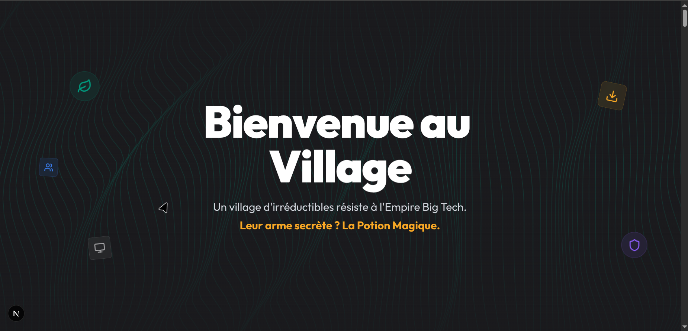

<div align="center">

# Village NIRD

### Le Village Numerique Resistant

**La Nuit de l'Info 2025**

[](https://main-chalange-nuit-de-linfo-2025.vercel.app)
[](https://nextjs.org/)
[](https://react.dev/)
[](https://www.typescriptlang.org/)
[](https://tailwindcss.com/)

<br />

[**Voir le Site**](https://main-chalange-nuit-de-linfo-2025.vercel.app) &#8226; [**Explorer le Code**](https://github.com/ahmed-abdat/main_chalange_nuit_de_linfo_2025)

<br />



</div>

---

## Le Concept

> *"Nous sommes en 2025. Toutes les ecoles francaises sont occupees par Big Tech... Toutes ? Non ! Un village d'irreductibles enseignants et eleves resiste encore a l'envahisseur numerique."*

**Village NIRD** utilise la metaphore d'Asterix pour sensibiliser aux enjeux de la souverainete numerique. Le **14 octobre 2025**, Microsoft met fin au support de Windows 10, laissant **240 millions d'ordinateurs** face a un dilemme : payer, jeter, ou **resister avec Linux**.

---

## Fonctionnalites

<table>
<tr>
<td width="50%">

### Scrollytelling Narratif
Une experience immersive qui guide l'utilisateur de la crise a la solution NIRD.

- Hero dramatique avec metaphore Asterix
- Statistiques animees en temps reel
- Calculateur d'economies interactif
- Les 3 piliers NIRD expliques

</td>
<td width="50%">

### 5 Mini-Jeux Educatifs
Apprendre en jouant avec des mecaniques variees.

- **Refurbish Game** - Sauvez un PC obsolete
- **Memory Game** - Associez logiciels libres
- **Tower Defense** - Defendez le village
- **Quiz NIRD** - Testez vos connaissances
- **Typing Game** - Maitrisez le terminal

</td>
</tr>
<tr>
<td width="50%">

### Scenarios Etudiants
6 scenarios educatifs interactifs avec systeme de points.

- Windows 10 EOL vs Linux
- Office vs LibreOffice
- Vie privee et donnees
- Jeux video libres
- Addiction aux reseaux

</td>
<td width="50%">

### Design Immersif
Interface moderne avec animations fluides.

- Animations Framer Motion
- Theme "Emerald Resistance"
- Responsive design
- Mode sombre natif

</td>
</tr>
</table>

---

## Les 3 Piliers NIRD

| Pilier | Description | Impact |
|:------:|-------------|--------|
| **Inclusif** | Tech pour tous, reconditionnement de PCs | 132 PCs reconditionnes, 11 ecoles equipees |
| **Responsable** | Souverainete des donnees, logiciels libres | Donnees en France, conformite RGPD |
| **Durable** | Prolonger la vie du materiel avec Linux | 8-10 ans de duree de vie, 300kg CO2 economises |

---

## Stack Technique

```
Frontend        Next.js 16 + React 19 + TypeScript 5
Styling         Tailwind CSS 4 + shadcn/ui
Animations      Framer Motion 12
State           Zustand 5
3D (optionnel)  Three.js + React Three Fiber
```

---

## Demarrage Rapide

```bash
# Cloner le projet
git clone https://github.com/ahmed-abdat/main_chalange_nuit_de_linfo_2025.git
cd main_chalange_nuit_de_linfo_2025

# Installer les dependances
pnpm install

# Lancer en developpement
pnpm dev

# Build de production
pnpm build
```

Le site sera accessible sur `http://localhost:3000`

---

## Structure du Projet

```
src/
├── app/                    # Pages Next.js (App Router)
│   ├── page.tsx           # Landing page principale
│   ├── scenarios/         # Defis du quotidien
│   └── student-scenarios/ # Scenarios etudiants
├── components/
│   ├── narrative/         # Sections du scrollytelling
│   ├── games/             # Mini-jeux interactifs
│   ├── ui/                # Composants UI (shadcn)
│   └── scenarios/         # Cartes de scenarios
├── data/                   # Donnees statiques (scenarios, quiz)
├── store/                  # Zustand stores
└── hooks/                  # Hooks personnalises
```

---

## Performances

| Metrique | Score | Objectif |
|----------|:-----:|:--------:|
| Lighthouse Performance | 95+ | > 90 |
| First Contentful Paint | < 1.5s | < 2s |
| Largest Contentful Paint | < 2.5s | < 3s |
| EcoIndex | Grade A | Grade B |

---

## Liens Utiles

| Ressource | Lien |
|-----------|------|
| NIRD Officiel | [nird.forge.apps.education.fr](https://nird.forge.apps.education.fr/) |
| Linux NIRD | [nird.forge.apps.education.fr/linux](https://nird.forge.apps.education.fr/linux/) |
| La Nuit de l'Info | [nuitdelinfo.com](https://www.nuitdelinfo.com/) |
| PrimTux | [primtux.fr](https://primtux.fr/) |

---

## Equipe

<div align="center">

**Faculte des Sciences et Techniques**
Universite de Nouakchott Al Aasriya, Mauritanie

---

Cree avec &#10084; pour **La Nuit de l'Info 2025**

*"Ensemble, l'irreductibilite numerique est possible !"*

</div>

---

<div align="center">

**MIT License** &#8226; [Voir la Licence](LICENSE)

</div>
